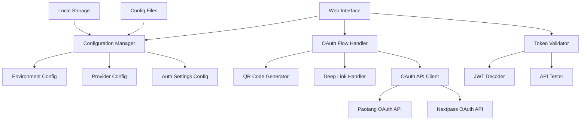

# Design Document

## Overview

The OAuth Testing Platform is a Next.js web application that provides a comprehensive interface for testing OAuth flows with multiple providers (Paotang and Nextpass) across different environments. The platform features a modular architecture with configuration management, real-time OAuth flow testing, and token validation capabilities.

## Architecture

### High-Level Architecture



### Technology Stack

- **Frontend Framework**: Next.js 15 with React 19
- **Styling**: Tailwind CSS with shadcn/ui components
- **State Management**: React Context API with useReducer
- **Storage**: Browser Local Storage for configuration persistence
- **HTTP Client**: Native fetch API with custom wrapper
- **QR Code Generation**: qrcode library
- **JWT Handling**: jose library for JWT decoding
- **Type Safety**: TypeScript throughout

## Components and Interfaces

### Core Components

#### 1. Configuration Manager (`ConfigurationManager`)
```typescript
interface ConfigurationManager {
  environments: EnvironmentConfig[];
  providers: ProviderConfig[];
  currentEnvironment: Environment;
  currentProvider: string;
  
  loadConfiguration(): Promise<void>;
  saveConfiguration(): Promise<void>;
  switchEnvironment(env: Environment): void;
  switchProvider(providerId: string): void;
  updateProviderConfig(providerId: string, config: ProviderConfig): void;
}
```

#### 2. OAuth Flow Handler (`OAuthFlowHandler`)
```typescript
interface OAuthFlowHandler {
  initiateFlow(provider: string, method: AuthMethod): Promise<OAuthResponse>;
  handleCallback(code: string, state: string): Promise<TokenResponse>;
  generateQRCode(authUrl: string): Promise<string>;
  generateDeepLink(provider: string): string;
}
```

#### 3. Token Validator (`TokenValidator`)
```typescript
interface TokenValidator {
  validateToken(token: string, provider: string): Promise<ValidationResult>;
  decodeJWT(token: string): JWTPayload;
  testAPICall(token: string, endpoint: string): Promise<APIResponse>;
}
```

### Data Models

#### Environment Configuration
```typescript
interface EnvironmentConfig {
  name: Environment;
  displayName: string;
  baseUrl: string;
  isDefault: boolean;
}

type Environment = 'sit' | 'uat' | 'prd';
```

#### Provider Configuration
```typescript
interface ProviderConfig {
  id: string;
  name: string;
  clientId: string;
  clientSecret: string;
  callbackUrl: string;
  authUrl: string;
  tokenUrl: string;
  userInfoUrl: string;
  authSettings: AuthSettings;
  scopes: string[];
  supportedMethods: AuthMethod[];
}

interface AuthSettings {
  ACR: string[];
  Prompt: ('none' | 'login')[];
}

type AuthMethod = 'qr-code' | 'app-to-app';
```

#### OAuth Response Models
```typescript
interface OAuthResponse {
  authUrl: string;
  state: string;
  codeChallenge?: string;
  method: AuthMethod;
}

interface TokenResponse {
  accessToken: string;
  refreshToken?: string;
  tokenType: string;
  expiresIn: number;
  scope: string;
}

interface ValidationResult {
  isValid: boolean;
  errors: string[];
  tokenInfo: JWTPayload;
  apiTestResults: APITestResult[];
}
```

### UI Component Structure

#### Main Layout Components
1. **Header**: Environment selector, provider switcher
2. **Sidebar**: Navigation between configuration and testing sections
3. **Main Content Area**: Dynamic content based on current section
4. **Footer**: Status indicators and action buttons

#### Configuration Sections
1. **Environment Configuration Panel**
2. **Provider Configuration Panel**
3. **Authentication Settings Panel**
4. **Scopes Management Panel**

#### Testing Interface
1. **OAuth Flow Initiator**
2. **QR Code Display**
3. **Deep Link Generator**
4. **Response Viewer**
5. **Token Validator**
6. **API Tester**

## Data Models

### Configuration Storage Schema

```typescript
interface AppConfiguration {
  version: string;
  environments: Record<Environment, EnvironmentConfig>;
  providers: Record<string, ProviderConfig>;
  userPreferences: {
    defaultEnvironment: Environment;
    defaultProvider: string;
    theme: 'light' | 'dark';
  };
}
```

### OAuth Flow State Management

```typescript
interface OAuthFlowState {
  currentFlow: {
    provider: string;
    method: AuthMethod;
    state: string;
    startTime: number;
  } | null;
  
  responses: {
    authResponse?: OAuthResponse;
    tokenResponse?: TokenResponse;
    validationResult?: ValidationResult;
  };
  
  errors: {
    configErrors: string[];
    flowErrors: string[];
    apiErrors: string[];
  };
}
```

## Error Handling

### Error Categories

1. **Configuration Errors**
   - Missing required fields
   - Invalid URL formats
   - Malformed JSON configuration

2. **OAuth Flow Errors**
   - Invalid authorization codes
   - Token exchange failures
   - Callback URL mismatches

3. **API Errors**
   - Network connectivity issues
   - Invalid tokens
   - Provider-specific errors

### Error Handling Strategy

```typescript
interface ErrorHandler {
  handleConfigError(error: ConfigError): void;
  handleOAuthError(error: OAuthError): void;
  handleAPIError(error: APIError): void;
  displayUserFriendlyError(error: AppError): void;
}

class AppError extends Error {
  category: ErrorCategory;
  code: string;
  userMessage: string;
  technicalDetails: string;
  suggestions: string[];
}
```

### Error Recovery Mechanisms

1. **Automatic Retry**: For transient network errors
2. **Fallback Configuration**: Default values for missing config
3. **Graceful Degradation**: Disable features when dependencies fail
4. **User Guidance**: Clear error messages with resolution steps

## Testing Strategy

### Unit Testing Approach

1. **Configuration Management Tests**
   - Configuration loading/saving
   - Environment switching
   - Provider configuration validation

2. **OAuth Flow Tests**
   - URL generation
   - State management
   - Token exchange simulation

3. **Token Validation Tests**
   - JWT decoding
   - Token validation logic
   - API call simulation

### Integration Testing

1. **End-to-End OAuth Flows**
   - Complete OAuth flow simulation
   - Cross-provider compatibility
   - Error scenario handling

2. **Configuration Persistence**
   - Local storage integration
   - Configuration import/export
   - Environment switching

### Testing Tools and Framework

- **Unit Tests**: Jest with React Testing Library
- **Integration Tests**: Playwright for E2E testing
- **API Mocking**: MSW (Mock Service Worker) for OAuth provider simulation
- **Component Testing**: Storybook for UI component isolation

### Test Data Management

```typescript
interface TestDataProvider {
  getValidProviderConfig(providerId: string): ProviderConfig;
  getInvalidProviderConfig(): ProviderConfig;
  getMockTokenResponse(): TokenResponse;
  getMockAPIResponse(endpoint: string): APIResponse;
}
```

### Performance Testing

1. **Configuration Loading Performance**
2. **OAuth Flow Response Times**
3. **UI Responsiveness During API Calls**
4. **Memory Usage During Extended Testing Sessions**

## Security Considerations

### Client-Side Security

1. **Sensitive Data Handling**
   - Client secrets stored in environment variables only
   - No sensitive data in browser storage
   - Secure token handling in memory

2. **CSRF Protection**
   - State parameter validation
   - Secure random state generation
   - Callback URL validation

3. **XSS Prevention**
   - Input sanitization
   - Content Security Policy headers
   - Safe HTML rendering

### OAuth Security Best Practices

1. **PKCE Implementation** for public clients
2. **Secure Redirect URI** validation
3. **Token Expiration** handling
4. **Scope Limitation** to minimum required

## Deployment and Configuration

### Environment-Specific Configuration

```typescript
interface DeploymentConfig {
  environment: Environment;
  allowedOrigins: string[];
  defaultProviders: string[];
  featureFlags: {
    enableQRCode: boolean;
    enableDeepLinks: boolean;
    enableTokenValidation: boolean;
  };
}
```

### Build Configuration

1. **Next.js Configuration**
   - API routes for OAuth callbacks
   - Static asset optimization
   - Environment variable handling

2. **Tailwind CSS Configuration**
   - Custom component styles
   - Responsive design breakpoints
   - Dark mode support

3. **TypeScript Configuration**
   - Strict type checking
   - Path mapping for imports
   - Build optimization
